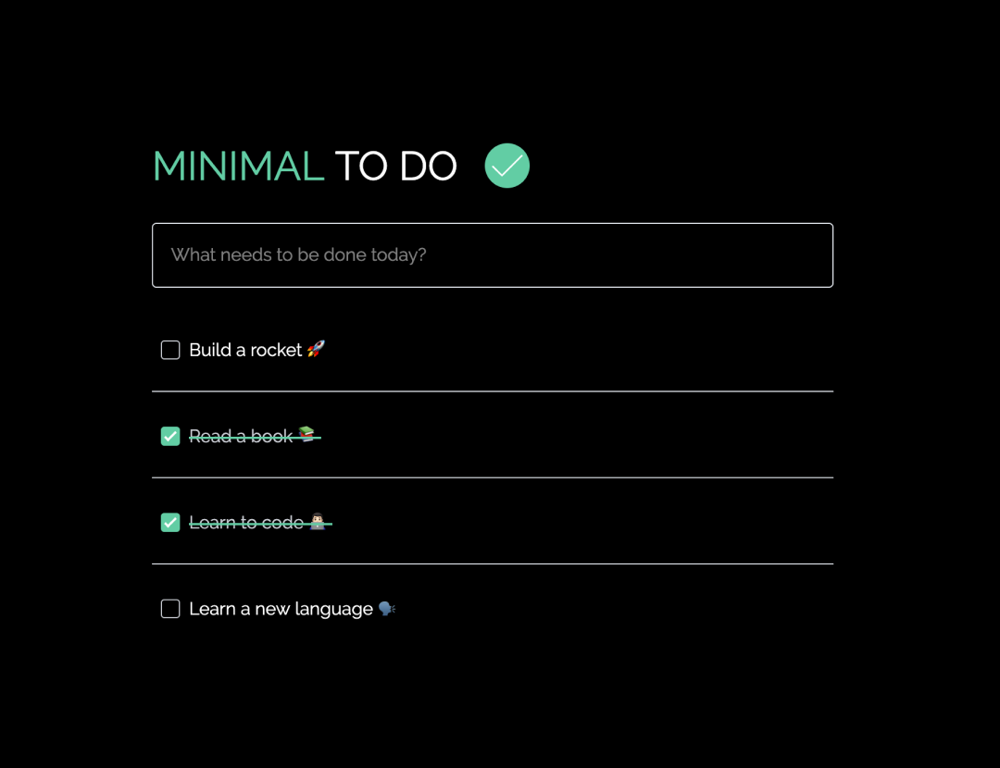

# Minimal To Do App ✔️

> A simple/minimal to do app using Vue.js and Tailwind.css.



## Build Setups

### Install ⚙️

```
npm install / yarn install
```

### Start 🏃

```
npm run dev / yarn dev
```

### Build 😷

```
npm run build / yarn build
```
